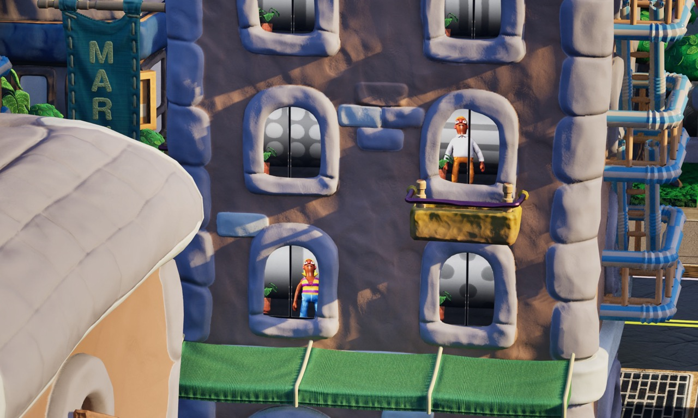
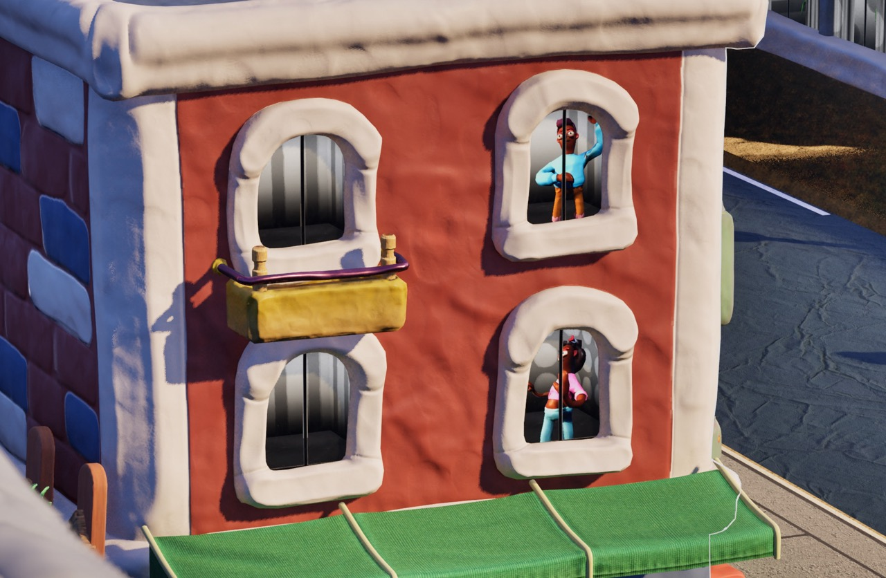
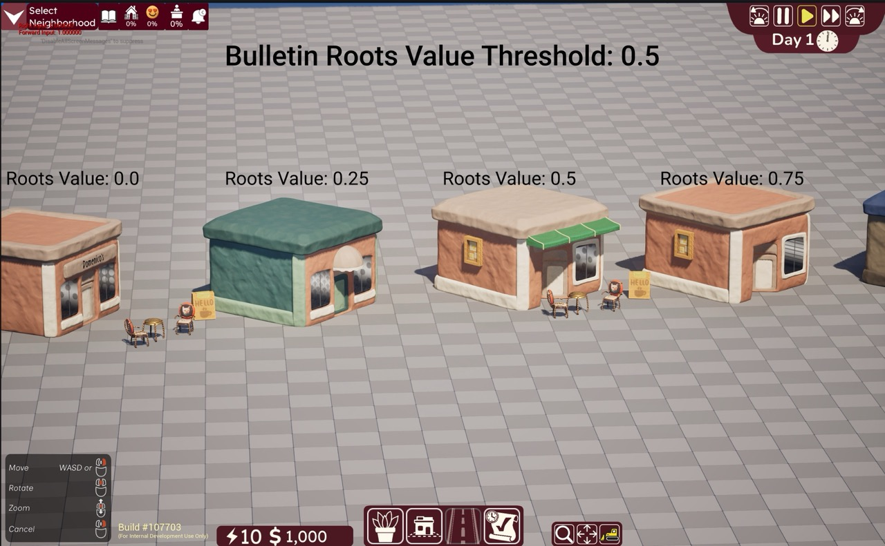
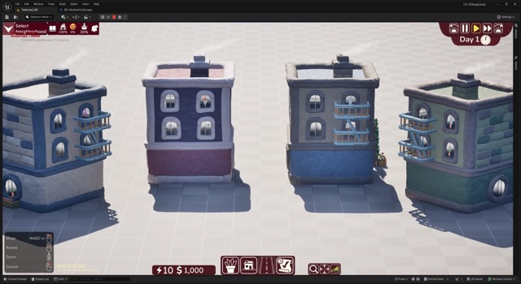
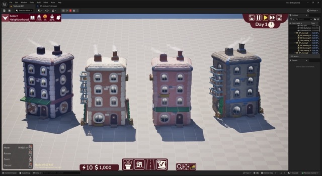

## Description
**Neighborhoods** is a city-*fixer* game, spinning off the city-builder genre by focusing on revitalizing pre-existing communities instead of building one from scratch.

As a C++ Gameplay Engineer Intern, I
- Developed an **ECS-driven Crowd AI system** simulating pathfinding and daily routines for 1000s of agents.
- Co-built an **interior parallax window system** with tech artist, lazy-rendering NPCs into 1000s of windows.
- **Supported our VFX artists** by implementing VFX and driving feature requests for our procedurally-generated building system.
## Parallax Window System
### First Iteration

*Neighborhoods* has thousands of residents each with a simulated life and an address. I was assigned to render residents when they are in their home.

To accomplish this, I created a window render request subsystem.
- Each Window Render Request has a **priority** and **soft-pointers** to the person, its occupancy unit, and texture.
- Requests are stored in a **priority queue**, prioritizing residents that just moved in/out.
- Rendering windows is **rate-limited per tick** to prevent sudden frame drops.

How rendering works:
- When rendering a request, a transient "photo studio" is created. An actor is spawned, along with a camera and key light. The camera "takes a photo" of the person and saves it as a texture.
- Once a random window in the occupancy unit is chosen, the texture gets assigned in the window's dynamic material instance.
### Second Iteration
Now all the people are correctly rendered, but you might have noticed that they all strike the same boring pose. Believe it or not, but the residents in *Neighborhoods* have feelings too. My next task was to randomize their poses and have it reflect their `Satisfaction Level`.

Before I could assign poses, I need a set of animations to select from.
- I created an `Animation Data Table` to categorize all the animations in our project.
- Used AI to label all the animations into a CSV.
- Added to our `BP Function Library` to make the table globally accessible.

Now when rendering a window, the window manager selects an animation based on the resident's satisfaction, sets the pose to the halfway point of the animation, and then proceeds to take a picture, all in a single tick.
### Third Iteration
Next steps are to animate the residents within each window. This will require me to render animations into sprite sheets. I have a few concerns with gpu memory limitations.
##  ECS-driven Crowd AI system
I'm currently developing the pedestrian system, which is handled with Unreal's Mass Entity System. I'm currently tasked with navigating each pedestrian from the home to work, whether that be with by car, bus or on foot.

I will update this section once I make more progress.
## Procedurally Generated Buildings
I was tasked with creating procedural scaffolding when new buildings go under construction.

<iframe width="512" height="288" src="https://www.youtube.com/embed/DUp0LWBydow?si=kDnW26G0UGnMgvVi" title="YouTube video player" frameborder="0" allow="accelerometer; autoplay; clipboard-write; encrypted-media; gyroscope; picture-in-picture; web-share" referrerpolicy="strict-origin-when-cross-origin" allowfullscreen></iframe>
*The scaffolding adapt to to the height and size of the building.*

<iframe width="512" height="288" src="https://www.youtube.com/embed/DJMmg0C1o80?si=e0p3cBgCFIvS-ESx" title="YouTube video player" frameborder="0" allow="accelerometer; autoplay; clipboard-write; encrypted-media; gyroscope; picture-in-picture; web-share" referrerpolicy="strict-origin-when-cross-origin" allowfullscreen></iframe>
*Showcase of the scaffolding blueprint.*

As my onboarding task, I implemented randomized height-based building attachments, such as fire escapes and bulletin boards.

*Bulletin Boards only show up when a building's cultural involvement value exceeds a threshold.*

*Fire Escapes are procedurally generated based on building height.*
