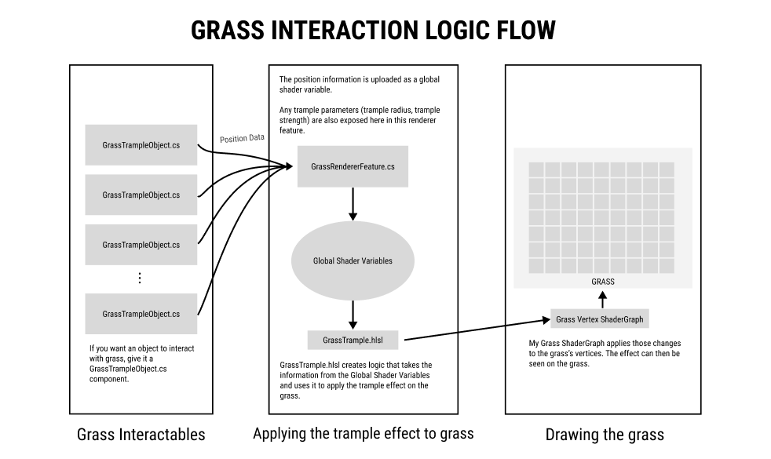
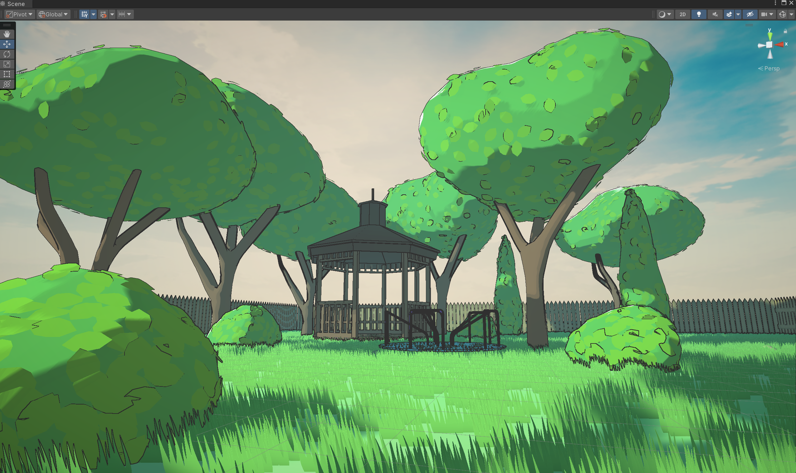

## Description
**Scare-Crow** is a humorous 3rd person stealth/planning game where you play as a crow who scares squirrels away from bird feeders.

As the **Graphics Engineer**, I worked with the Art and Engineering Director, developing shaders and render pipelines to create a performant visual style.
Some features I developed are:
- GPU-Instanced Foliage System
- Normal-Based Outline Shader
- Toon Shader with Screen-Depth Water Rendering
- Various VFX

## Interactive Foliage
Designed a GPU-Instanced foliage system with player interaction support.

<iframe width="512" height="288" src="https://www.youtube.com/embed/hv6JCuFKhrQ?si=5lbV86X_eRT1xcQx" title="YouTube video player" frameborder="0" allow="accelerometer; autoplay; clipboard-write; encrypted-media; gyroscope; picture-in-picture; web-share" referrerpolicy="strict-origin-when-cross-origin" allowfullscreen></iframe>

## Gallery
Here are some of the shaders and VFX I made for this project.

