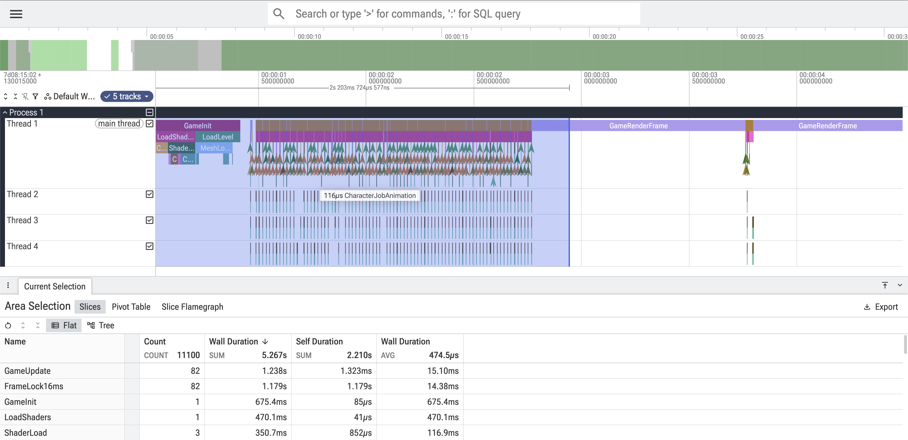
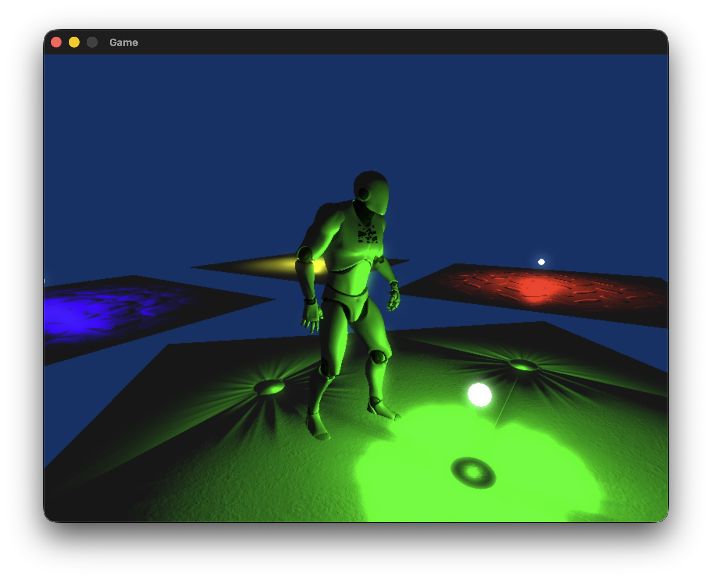
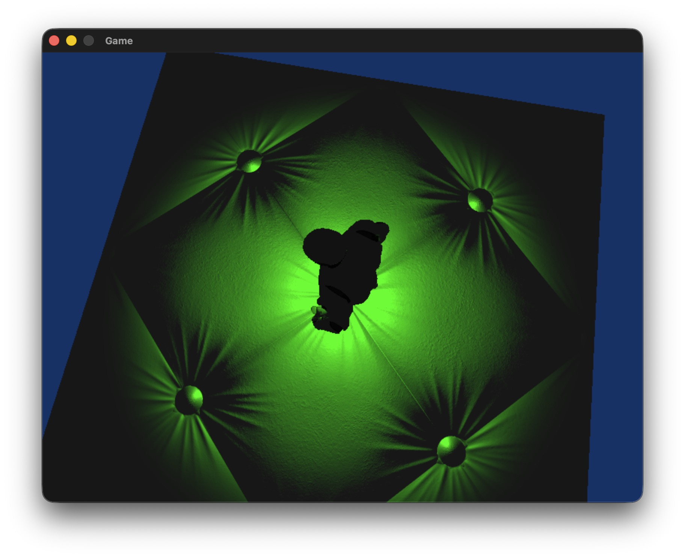
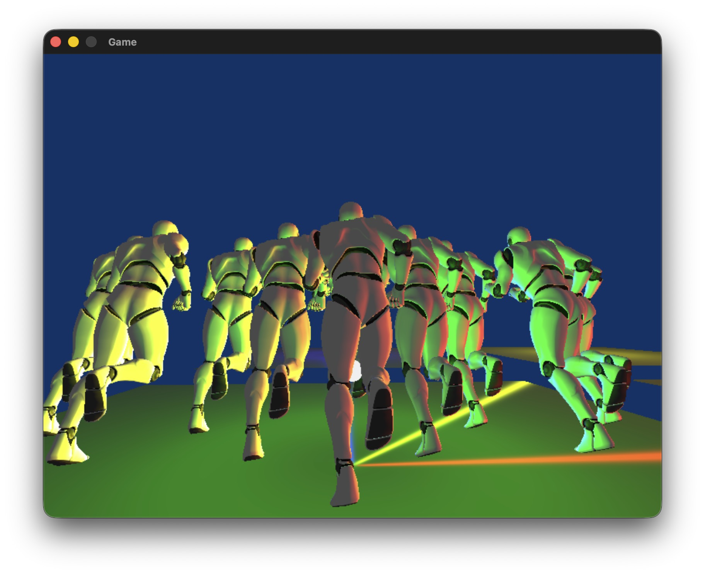
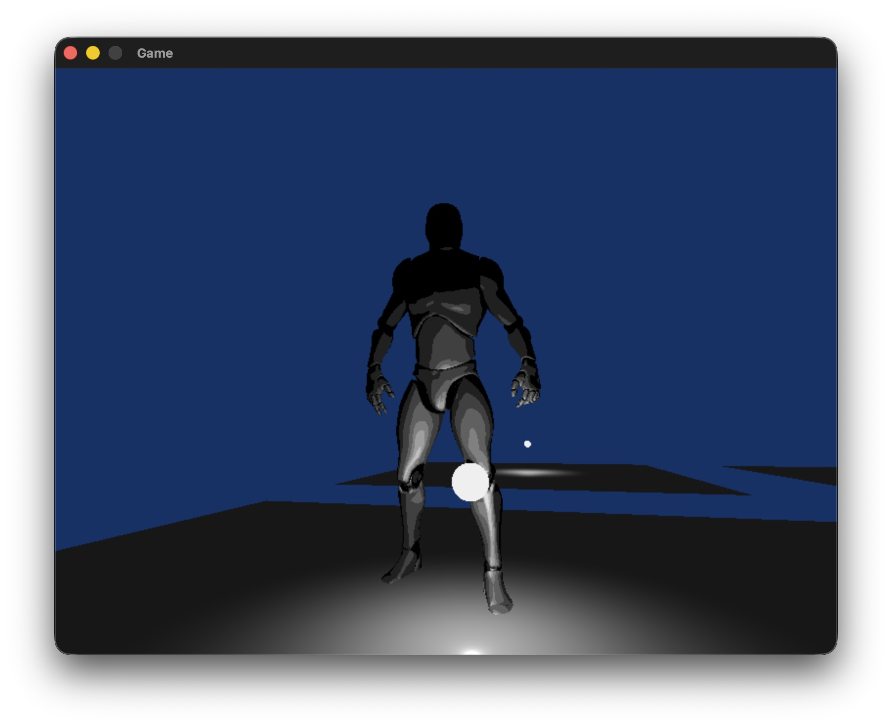

## Description
I made a custom C++ Game Engine using SDL3 GPU. To showcase some of its features, I recreated a 3D version of Qbert!

<iframe width="512" height="288" src="https://www.youtube.com/embed/YiZGao4Bvu8" title="QbertGameplayDemo" frameborder="0" allow="accelerometer; autoplay; clipboard-write; encrypted-media; gyroscope; picture-in-picture; web-share" referrerpolicy="strict-origin-when-cross-origin" allowfullscreen></iframe>

## Features
- **Blinn-Phong Shading**
- **Normal Maps**
- **Collision Detection** (AABB vs AABB and Line Segment vs AABB)
- Skinned Skeletal **Animation System**
    - Global Pos Matrices are calculated asynchronously.
    - Skinned weight blending happens in a vertex shader.
    - Spherical LERP between each keyframe.
- Thread-Safe Scoped **Profiler**
    - Uses macros to allow the profiling of any function.
    - Outputs into a JSON file that can be imported into trace viewers like Perfetto UI.
- Fast **Bloom**
    - This is done with a set of render passes that applies the blur at 1/4 resolution, before upscaling with bilinear filtering. Since the input is already blurred, there aren't any noticable artifacts.
    - The gaussian blur is achieved with a vertical (1-by-N) pass followed by a horizontal (1-by-N) pass, rather than a single 2D gaussian pass, reducing the blur operation from N&sup2; per pixel to 2N per pixel.
- **SIMD** Math Library
    - Structures and operations for Vectors, Matrices, and Quaternions.
    - SIMD optimization for Vector3 and Vector4 operations.
- Tween Engine

## Gallery

