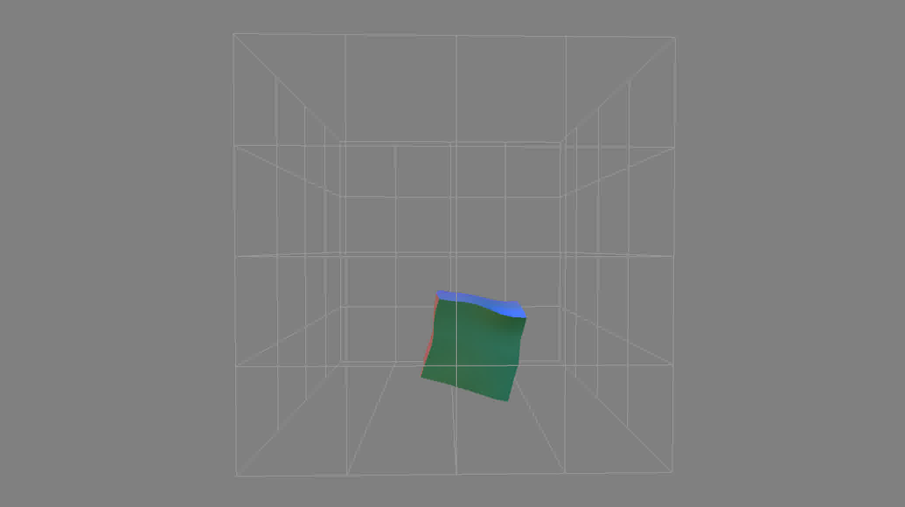
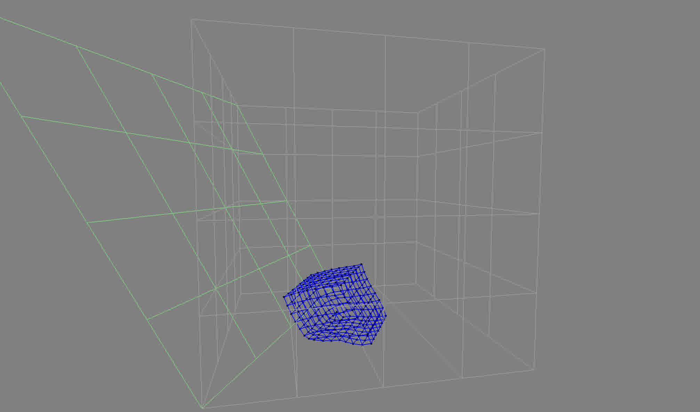

## Description
Real-time soft body simulation using a mass-spring system. The simulation includes gravity, user interaction, and collision detection.

<iframe src="https://www.youtube-nocookie.com/embed/OSa510Nc0Qg?autoplay=1&modestbranding=1&rel=0&iv_load_policy=3" style="aspect-ratio: 378 / 213;" title="Jello 1" frameborder="0" allowfullscreen></iframe>
<iframe src="https://www.youtube-nocookie.com/embed/GWnLUAz24Ck?autoplay=1&modestbranding=1&rel=0&iv_load_policy=3" style="aspect-ratio: 378 / 213;" title="Jello 2" frameborder="0" allowfullscreen></iframe>

