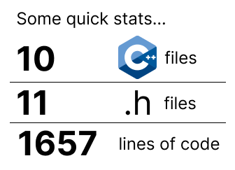
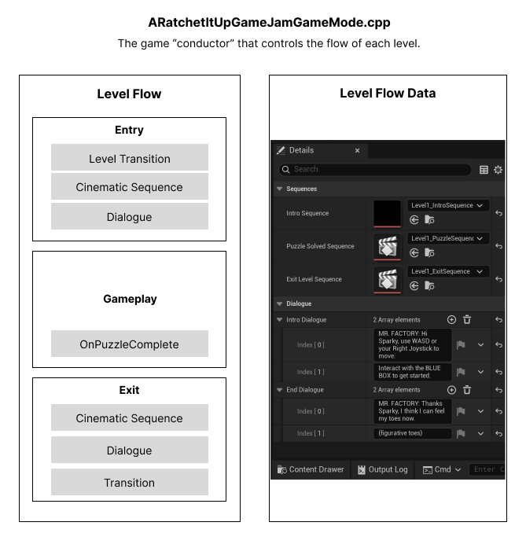
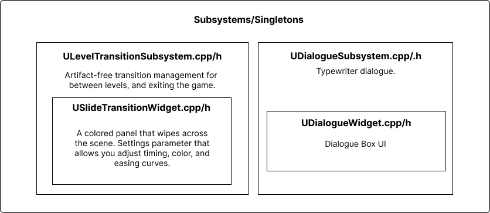

## Description
You are Sparky, a small robot tasked with reviving your father, Mr. Factory, after a power grid malfunction. Use your jumper cable hands to charge batteries, reconnect factory rooms, and ultimately, save your father!

<iframe width="512" height="288" src="https://www.youtube.com/embed/1vyfH-1t4LM?si=0DKp1Kh13sXb6HNK" title="YouTube video player" frameborder="0" allow="accelerometer; autoplay; clipboard-write; encrypted-media; gyroscope; picture-in-picture; web-share" referrerpolicy="strict-origin-when-cross-origin" allowfullscreen></iframe>

As the Engineer for this project, I wrote all of the C++ systems that encapsulated the gameplay. I tried to do most of my work in C++ for this project for three reasons:
1. C++ runs much faster.
2. Our Technical Design doc clearly laid out the systems required.
3. I wanted to get more familiar with Unreal C++.

## Level Flow
Our game has a main menu and 3 puzzle levels. For each level, we wanted dialogue and cinematic sequences. To handle the flow, I designed this GameMode class.

What I'm proud of is the level flow. Notice how the gameplay box is almost completely empty. Most of the gameplay logic was done through blueprints by my teammate, and it's completely separated from the level flow logic. The only event that the designer had to implement was the `OnPuzzleComplete` event, which would trigger the Exit level flow sequence. This allowed for both me and my designer's work to be completely separated.

## Transitions and Subsystems
To handle the flow between the menu and each level, I needed a class that could exist across all levels. To do that, I created `LevelTransitionSubsystem`, which would load levels with a nice horizontal slide transition.
I also create a Subsystem for the dialogue. All of the dialogue is entered through a unreal data asset called `Level Flow Data`, shown in the previous section.

